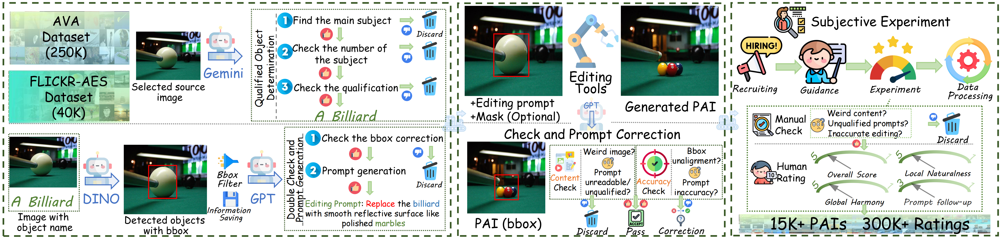

<div align="center">
    
    
 <div>
    <a href="https://github.com/jzhws/Partial-AIGC-IQA"></a>
    <a href="https://arxiv.org/abs/2504.09291"></a>
     <a href="https://huggingface.co/datasets/EPAIQA-15K"></a>
   </div>

<h1>Towards Explainable Partial-AIGC Image Quality Assessment</h1>

_[ACMMM2025] Official dataset for EQAIQA-15K dataset_

  <div>
      <a href="https://github.com/2022qjy" target="_blank">Jiaying Qian</a><sup>1</sup><sup>*</sup>,
      <a href="https://github.com/2022qjy" target="_blank">Ziheng Jia</a><sup>1</sup><sup>*</sup>,
      <a href="https://zzc-1998.github.io/" target="_blank">Zicheng Zhang</a><sup>1</sup>,
  </div>

<div>
      <a href="https://ee.sjtu.edu.cn/en/FacultyDetail.aspx?id=24&infoid=153&flag=153" target="_blank">Guangtao Zhai</a><sup>1</sup>
      <a href="https://scholar.google.com/citations?user=91sjuWIAAAAJ&hl=zh-CN&oi=ao" target="_blank">Xiongkuo Min</a><sup>1</sup><sup>#</sup>,
  </div>

  <div>
  <sup>1</sup>Shanghai Jiaotong University
       </div>   
 <div>
<sup>*</sup>Equal contribution. <sup>#</sup>Corresponding author. 
   </div>
  <div style="width: 100%; text-align: center; margin:auto;">
      
  </div>

  <div style="width: 100%; text-align: center; margin:auto;">
      
  </div>
<div align="left">
  
## 🔖 TODO：
- 🎯 Release the EPAIQA-15K dataset.

## Training Dataset
The dataset is being compiled and will be released soon!

## Citation

If you consider this work interesting, please feel free to cite it in your work!

```bibtex

@article{qian2025towards,
  title={Towards Explainable Partial-AIGC Image Quality Assessment},
  author={Qian, Jiaying and Jia, Ziheng and Zhang, Zicheng and Zhang, Zeyu and Zhai, Guangtao and Min, Xiongkuo},
  journal={arXiv preprint arXiv:2504.09291},
  year={2025}
}
```
